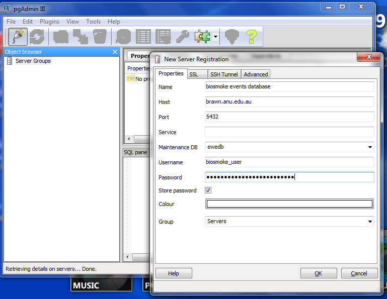
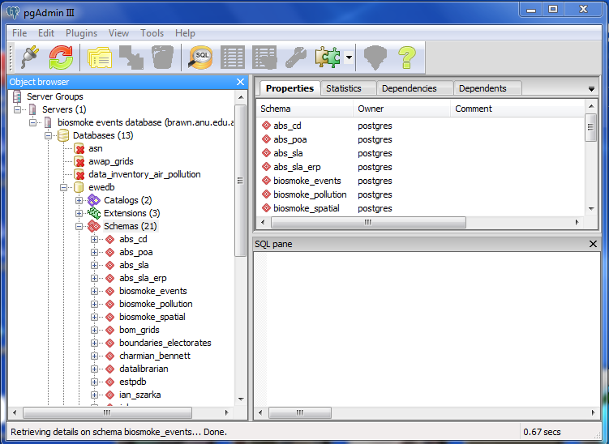
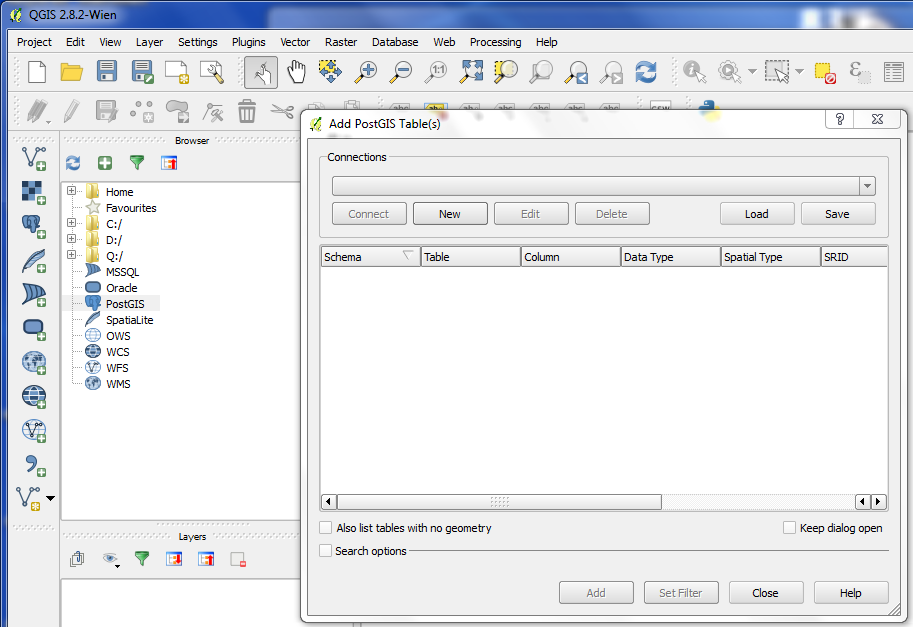
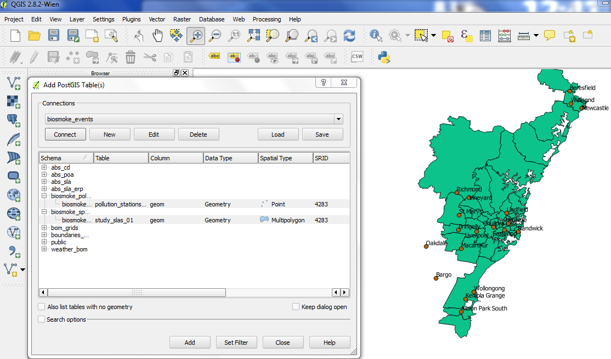

# Introduction 

These instructions are for users to access the database to browse or download data.
A password is required and available on request to the corresponding author.

# Public access to data and potential for making contributions

## The dates of historical extreme events

The database holds air pollution data for several Australian cities that have had gaps in the records inmputed and a network-averaging procedure applied.  These events are based on the percentiles of daily observations from that pre-computed data and are available within the database.  Additional data may be provided to the database however a process of vetting the data prior to being imported will be required.  The original project team reserve the right to include new air pollution data at their own discretion.

The full list of events and their validation source reference identifier is available for public download as shown in the image below.


## Adding reference material to the database

If a member of the research community has a known biomass smoke event date they can request authorisation to enter this data. The original project team reserve the right to include new validations for event dates at their own discretion. 

A member of the reseach community can make a request to be given the permission to edit the database.  These edits will be made to a staging area before validated events will be accepted by the database administrator and the master database is updated.

To make an addition the database is connected using an authenticated user with permission to write to the database then the Forms are used to first add a reference id (each report or satellite image has a unique ID)


- Then the event type, the dates and places that this reference validates are entered in the subform.
- There can be many events/places entered that are validated by a reference.


# Database access via pgAdmin for PostgreSQL management

- pgAdmin is recommended for advanced users
- Download and Install pgAdmin
- TODO fix the error link to brawn.anu to gislibrary.anu





# QGIS for Spatial Data Visualisation

- Download and install QGIS
- Click on the icon of the elephant






# Extending the Database using the Custom Built R Package

- The underlying pollution data from which extreme events are selected is created using a sequence of computational steps that create network averages of imputed daily pollution observations.
- The codes are all provided in an open source R package that interfaces with the database to create the pollution dataset.
- first download and install into your R library the rpostgrestools utility package [http://swish-climate-impact-assessment.github.io/rpostgrestools/](http://swish-climate-impact-assessment.github.com/rpostgrestools/)
- then Download and install the BiosmokeValidatedEvents R package [http://swish-climate-impact-assessment.github.io/BiosmokeValidatedEvents/](http://swish-climate-impact-assessment.github.com/BiosmokeValidatedEvents/)
- At the R console type

```{r, eval = F}
system.file(package = "BiosmokeValidatedEvents")
``` 

- This will return the location where the R package has been installed.  
- The scripts are in the `doc` directory, and the programs can be called from the `main.R` script found there.
- This assumes that there is an available PostGIS server called 'ewedb_staging' and that there is a table in that database called `biosmoke_pollution.combined_pollutants` that holds the new pollution data, along with spatial files `biosmoke_pollution.pollution_stations_combined_final` and `biosmoke_spatial.study_slas_01` that show the pollution monitoring stations and the Statistical Local Areas (SLA) that define the human populations of each study region.
