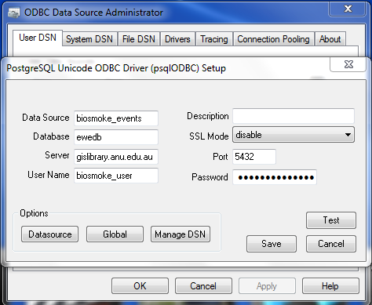
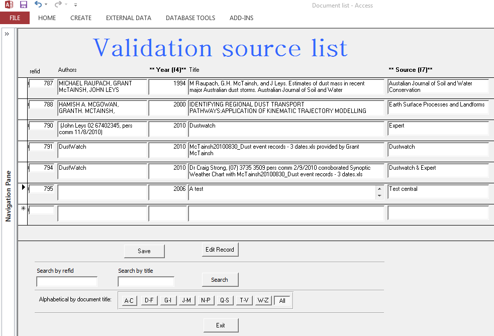
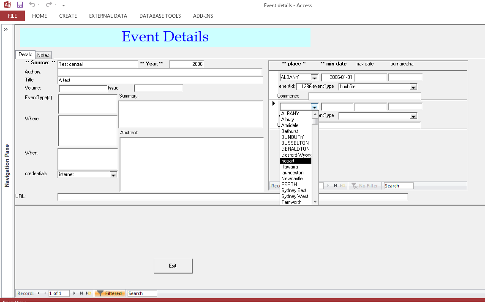

# Introduction 

These instructions are for users to access the database to browse or download data.
A password is required and available on request to the corresponding author.

# MS Access

- Download and install the latest version of psqlODBC from: [http://www.postgresql.org/ftp/odbc/versions/msi/](http://www.postgresql.org/ftp/odbc/versions/msi/)
- Please note: If running a 64-bit version of Windows, you will want to download and install BOTH the psqlodbc_XX_XX_XXXX.zip and psqlodbc_XX_XX_XXXX-x64.zip file. 
- Assuming you use the 32 bit windows office suite (recommended) then use the command below to open the ODBC connections tool and add a DSN for your postgres database
- Go to Start -> Run (or Press Windows+R keys) and enter  the following (using 32 drivers even if you are on a 64 machine):

```
    %WINDIR%\SysWOW64\odbcad32.exe
```

- On either the User DSN or System DSN tab, click the Add button - find the PostgreSQL ODBC Driver.
- Select UNICODE, and click Finish.
- Data Source = biosmoke_events
- Database = ewedb
- Server = gislibrary.anu.edu.au



- User Name and Password will be supplied to you on request.
- Click the Save button to create the DSN.

## Adding reference material

- If a user has a known date to enter then they can make an additional request to be given the permission to edit the database.  These edits will be made to a staging area before validated events will be accepted by the database administrator and the master database is updated.
- To make an addition the database is connected using an authenticated user with permission to write to the database then the Forms are used to first add a reference id (each report or satellite image has a unique ID)



- Then the dates and places that this reference validates are entered in the subform



# pgAdmin for PostgreSQL management

- pgAdmin is recommended for advanced users
- Download and Install pgAdmin
- TODO fix the error link to brawn.anu to gislibrary.anu


# QGIS for Spatial Data Visualisation

- Download and install QGIS
- Click on the icon of the elephant


# Extending the Database using the Custom Built R Package

- The underlying pollution data from which extreme events are selected is created using a sequence of computational steps that create network averages of imputed daily pollution observations.
- The codes are all provided in an open source R package that interfaces with the database to create the pollution dataset.
- first download and install into your R library the rpostgrestools utility package [http://swish-climate-impact-assessment.github.io/rpostgrestools/](http://swish-climate-impact-assessment.github.com/rpostgrestools/)
- then Download and install the BiosmokeValidatedEvents R package [http://swish-climate-impact-assessment.github.io/BiosmokeValidatedEvents/](http://swish-climate-impact-assessment.github.com/BiosmokeValidatedEvents/)
- At the R console type

```{r, eval = F}
system.file("package = "BiosmokeValidatedEvents")
``` 

- This will return the location where the R package has been installed.  
- The scripts are in the `doc` directory, and the programs can be called from the `main.R` script found there.
- This assumes that there is an available PostGIS server called 'ewedb_staging' and that there is a table in that database called `biosmoke_pollution.combined_pollutants` that holds the new pollution data, along with spatial files `biosmoke_pollution.pollution_stations_combined_final` and `biosmoke_spatial.study_slas_01` that show the pollution monitoring stations and the Statistical Local Areas (SLA) that define the human populations of each study region.
